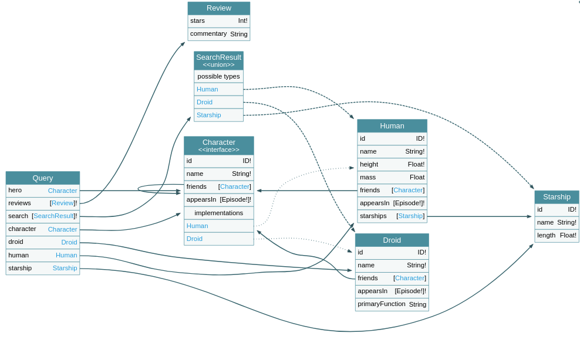

# Tasks

## Task1

### Goals

* Mount a GraphQL server:
  - [Task1 GraphQL Schema](task1-schema.graphql)
  - Data:
    - [droids.json](droids.json)
    - [films.json](films.json)
    - [humans.json](humans.json)
    - [starships.json](starships.json)

* Dockerize it
* Put the keys in the README.md file


### Graph

#### Query Root


#### Mutation Root


### Examples

#### Query

```
{
  hero {
    id
    name
    friends {
      id
      name
      appearsIn
      friends {
        id
        name
        appearsIn
      }
    }
  }
  reviews(episode:EMPIRE){
    stars
    commentary
  }
  search(text:"a"){
    ...on Human{
      name
    }
    ...on Droid{
      name
    }
    ...on Starship{
      name
    }
  }
  character(id:1000){
    name
    appearsIn
    friends{
      name
    }
  }
  starship(id:2000){
    name
    length
  }
}

```
#### Mutation

```
mutation {
  createReview(episode: NEWHOPE, review: {stars: 5, commentary: "Lorem ipsum dolor sit amet, consectetur adipiscing elit. Phasellus venenatis tellus sed enim posuere fringilla. Proin aliquam ac tellus nec pulvinar. Aliquam erat volutpat. Proin lacinia turpis libero, vitae ornare mi ornare a. Phasellus mi diam, rutrum sed erat venenatis, auctor porta nibh. Aliquam tellus odio, efficitur at euismod sit amet, molestie a magna. Morbi dapibus nec nibh nec consequat. Aenean gravida sapien ac neque suscipit, efficitur blandit eros semper. Sed non risus vehicula, fermentum metus a, laoreet sem. Praesent eget neque auctor, scelerisque neque in, volutpat nibh. Fusce at neque sed nulla varius sagittis. Nulla facilisi."}) {
    stars
    commentary
  }
}
```

## References

https://apis.guru/graphql-voyager/
https://github.com/graph-gophers/graphql-go/tree/master/example/starwars/server
https://github.com/graphql/swapi-graphql
https://swapi.co/api/
